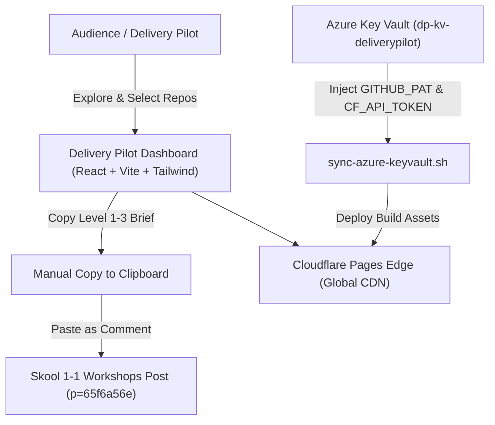

# Delivery Pilot Dashboard 🚀

> Interactive workshop catalog, repository explorer, and delivery engine for **Rifat Erdem Sahin's 460+ GitHub repositories** (`https://github.com/rifaterdemsahin?tab=repositories`).

[](https://rifaterdemsahin.github.io/delivery-pilot-dashboard/)
[](https://delivery-pilot-dashboard.pages.dev)
[](https://www.skool.com/delivery-pilot-8938/1-1-workshops?p=65f6a56e)

---

## 🌐 Live URLs & Access

- 🚀 **Live Production Dashboard**: [https://rifaterdemsahin.github.io/delivery-pilot-dashboard/](https://rifaterdemsahin.github.io/delivery-pilot-dashboard/)
- ⚡ **Cloudflare Pages URL**: [https://delivery-pilot-dashboard.pages.dev](https://delivery-pilot-dashboard.pages.dev)
- 🎓 **Skool 1-1 Workshops Post (Paste Comments Here)**: [https://www.skool.com/delivery-pilot-8938/1-1-workshops?p=65f6a56e](https://www.skool.com/delivery-pilot-8938/1-1-workshops?p=65f6a56e)
- 📦 **GitHub Repository**: [https://github.com/rifaterdemsahin/delivery-pilot-dashboard](https://github.com/rifaterdemsahin/delivery-pilot-dashboard)
- 📚 **GitHub Repositories**: [https://github.com/rifaterdemsahin?tab=repositories](https://github.com/rifaterdemsahin?tab=repositories)

---

## 🧭 Navigation & Admin Menu

The dashboard organizes delivery controls into clean navigation items and an **Admin** dropdown:
- **Repositories & Workshops**: Complete catalog of public and private repositories with search and basket builder.
- **Pre & Post Conditions Matrix**: Multi-level prerequisite and outcome definitions across engineering tracks.
- **Admin Dropdown**:
  - `Cloudflare & Key Vault Spec`: Architecture flow and edge pipeline documentation.
  - `Azure Key Vault`: Interactive credentials manager & Azure CLI secret generator.
  - `Cloudflare Edge`: Wrangler deployment options and CI/CD workflow specs.

---

## 🎓 Sunday Cohorts & 1-1 Workshop Template

Participants copy their customized session brief and paste it as a comment on the [Skool 1-1 Workshops Post](https://www.skool.com/delivery-pilot-8938/1-1-workshops?p=65f6a56e) before entering calls.

### Workshop Brief Structure

```text
COHORTS ON SUNDAYS

1-1 WORKSHOPS

🚨 Ready to bulletproof your AI stack before tonight’s session? Join us live as we step through foundational to advanced AI security presets, audit live repositories, and enforce strict runtime guardrails.

A) Meeting Preset: 1-1 AI Security Workshop VIP

Frequency: Weekly (Cohorts on Sundays / 1-1 Slots)
Time: Today @ 7:00 PM – 9:00 PM (BST / London Time)
Location: Skool Live Room
Lead Instructor / Host: Rifat Erdem Sahin (https://github.com/rifaterdemsahin)

Preconditions
• Active Skool account with VIP tier permissions for live laboratory access.
• Local environment setup with Git, Docker, Python 3.10+, and pre-cloned workshop repositories.
• Provisioned API keys (OpenAI / Anthropic / Gemini) with rate limits configured for red-teaming tests.

Agenda, Experience Levels & GitHub Repositories

Level 1: Fundamentals & Code Quality
• 📂 Workspaces & SonarQube Auditing: Setting up isolated environments with RBAC and running automated static code analysis using rifaterdemsahin/SonarQube.
• 🧠 Memory Retention & DLP: Locking down session histories to prevent accidental context and credential leakage.

Level 2: Guardrails & Tool Integrations
• 🛡️ Runtime Guardrails: Blocking live prompt injections, system prompt extraction, and jailbreak payloads before reaching models.
• 🔌 Zero-Trust Integrations: Securing model context protocol (MCP) endpoints and external API calls with strict authentication.

Level 3: Advanced Sandboxing & Infrastructure Security
• 📦 Containerized Execution: Executing generated agent code within isolated sandbox containers.
• ☁️ Cluster Logging & Auditing: Capturing runtime events using OpenShift/Kubernetes event routing patterns referenced in rifaterdemsahin/OpenShiftEventRouter.

Postconditions
• Target AI architecture stress-tested against prompt injections and unauthenticated execution vectors.
• Memory isolation, RBAC, and container sandboxing verified operating in production-equivalent setups.
• Participant issued a customized remediation roadmap backed by sample presets from the workshop GitHub organization.
```

---

## 🛠️ Architecture & Tech Stack



---

## 🔐 Azure Key Vault Configuration

Run the automated helper to store secrets in your Azure Key Vault:

```bash
# 1. Login to Azure
az login

# 2. Set secrets in your Azure Key Vault
az keyvault secret set --vault-name "dp-kv-deliverypilot" --name "CLOUDFLARE-API-TOKEN" --value "<TOKEN>"
az keyvault secret set --vault-name "dp-kv-deliverypilot" --name "CLOUDFLARE-ACCOUNT-ID" --value "<ACCOUNT_ID>"
az keyvault secret set --vault-name "dp-kv-deliverypilot" --name "GITHUB-PAT" --value "<PAT>"

# 3. Pull secrets into local environment
bash scripts/sync-azure-keyvault.sh
```

---

## 📄 License
MIT © [Rifat Erdem Sahin](https://github.com/rifaterdemsahin)
