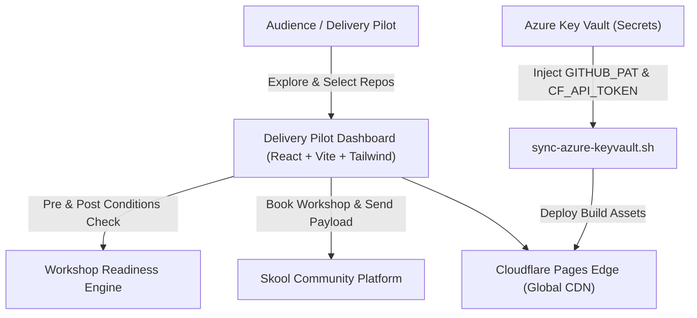

# Delivery Pilot Dashboard 🚀

> Interactive workshop catalog, repository explorer, and delivery engine for **Rifat Erdem Sahin's 460+ GitHub repositories** (`https://github.com/rifaterdemsahin?tab=repositories`). 

Designed for **Delivery Pilot** audiences and engineering teams to select repositories, verify **Pre & Post Conditions**, synchronize cloud credentials via **Azure Key Vault**, deploy directly to **Cloudflare Edge**, and book live workshop sessions on **Skool**.

---

## 🌟 Key Features

1. **Complete Public & Private Repositories Catalog**:
   - Lists all 464+ repositories with clear **PUBLIC** and **PRIVATE** visibility badges.
   - Categorized into domains: *AI & LLM*, *Cybersecurity & Adversarial*, *Cloud & DevOps*, *FullStack & Web Apps*, and *Automation & Tooling*.
   - Instant search, multi-faceted filtering by language, category, and stars.

2. **Workshop Interest Basket & Builder**:
   - Select multiple repositories to craft a customized workshop delivery track.
   - Live calculation of workshop scope, duration, and dependencies.
   - Instant copy/export of tailored workshop curriculum brief.

3. **Pre-Conditions & Post-Conditions Engine**:
   - **Pre-Conditions**: Explicit prerequisites (Git PAT, Node/Python/Docker environments, API keys, Azure & Cloudflare credentials) required prior to workshop kickoff.
   - **Post-Conditions**: Measurable definitions of done (live Cloudflare Edge deployment, automated CI/CD green status, zero secret leaks, eval benchmarks >= 90%).

4. **Skool Platform Integration**:
   - Direct interactive booking modal to schedule workshop delivery sessions on the **Skool** community platform.
   - Pre-fills customized repository choices, track goals, and attendee details.

5. **Cloudflare Edge Deployment**:
   - Fully optimized static Single Page Application (SPA) with `wrangler.toml`, `_headers`, and `_redirects`.
   - Automated GitHub Actions workflow (`.github/workflows/deploy-cloudflare.yml`) for zero-downtime edge deployments.

6. **Azure Key Vault Zero-Trust Credential Store**:
   - Automated scripts (`scripts/sync-azure-keyvault.sh`) and Azure CLI commands generator to securely fetch and inject `GITHUB_PAT`, `CLOUDFLARE_API_TOKEN`, and AI service keys without storing plaintext secrets in code.

---

## 🛠️ Architecture & Tech Stack



---

## 🚀 Quick Start

### 1. Install Dependencies & Enrich Repos Data
```bash
npm install
npm run enrich
```

### 2. Run Local Development Server
```bash
npm run dev
```

The application will be available at `http://localhost:3000`.

### 3. Production Build & Verification
```bash
npm run build
```

### 4. Deploy to Cloudflare Pages
```bash
# Set your Cloudflare credentials (or fetch via Azure Key Vault)
export CLOUDFLARE_API_TOKEN="<your-cloudflare-token>"
export CLOUDFLARE_ACCOUNT_ID="<your-cloudflare-account-id>"

# Deploy dist output
npx wrangler pages deploy dist --project-name=delivery-pilot-dashboard
```

---

## 🔐 Azure Key Vault Configuration

Run the automated helper to store secrets in your Azure Key Vault:

```bash
# 1. Login to Azure
az login

# 2. Set secrets in your Azure Key Vault
az keyvault secret set --vault-name "kv-deliverypilot-vault" --name "CLOUDFLARE-API-TOKEN" --value "<TOKEN>"
az keyvault secret set --vault-name "kv-deliverypilot-vault" --name "CLOUDFLARE-ACCOUNT-ID" --value "<ACCOUNT_ID>"
az keyvault secret set --vault-name "kv-deliverypilot-vault" --name "GITHUB-PAT" --value "<PAT>"

# 3. Pull secrets into local environment
bash scripts/sync-azure-keyvault.sh
```

---

## 📋 Workshop Pre & Post Conditions Overview

| Domain | Pre-Conditions (Prerequisites) | Post-Conditions (Target Outcomes) |
|---|---|---|
| **AI & LLM** | Python 3.10+, OpenAI/Gemini Key in Key Vault, Vector DB setup | Live AI agent on Cloudflare Workers AI, Benchmark eval >= 90%, Sub-second streaming |
| **Cybersecurity** | Docker sandbox, Adversarial test suite, Security credentials | Attack evasion simulated & blocked, 0 plaintext secret leaks, Audit telemetry active |
| **Cloud & DevOps** | Azure Subscription, Terraform CLI, Cloudflare API Token | IaC deployed without drift, SSL edge operational, Key Vault auto-sync running |
| **FullStack** | Node.js 20 LTS, Chrome browser, Git PAT | SPA deployed to Cloudflare Pages, 100% Lighthouse score, Skool booking verified |

---

## 🎓 Book a Workshop on Skool

Visit the Skool community to schedule cohort dates and review materials:
- **Skool Community**: [https://www.skool.com](https://www.skool.com)
- **GitHub Repositories**: [https://github.com/rifaterdemsahin?tab=repositories](https://github.com/rifaterdemsahin?tab=repositories)

---

## 📄 License
MIT © [Rifat Erdem Sahin](https://github.com/rifaterdemsahin)
